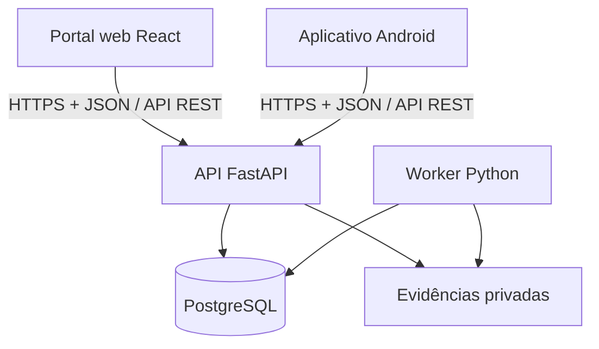

# RotaLog Backend

API e núcleo de regras de negócio do **RotaLog**, um marketplace B2B para reposição de alimentos secos e industrializados que conecta empresas compradoras, fornecedores, motoristas e a operação da RotaLog.

Este repositório concentra autenticação, autorização, consistência transacional, pedidos, pagamentos, logística, provas de entrega, disputas, auditoria e integrações. O backend é a única porta de acesso aos dados do sistema: o portal web e o aplicativo Android não acessam o banco diretamente.

> **Estado atual:** o repositório contém a fundação da API FastAPI, o endpoint de saúde e a base do SQLAlchemy. Os módulos de negócio descritos abaixo representam a arquitetura definida no documento técnico e serão implementados de forma incremental conforme o Backlog.

## Responsabilidades

- expor uma API REST autenticada e documentada por OpenAPI;
- validar entrada, permissões, organização ativa e transições de estado;
- coordenar catálogo, ofertas, estoque, checkout, pagamentos e pedidos;
- controlar preparação, rotas, custódia, entrega, retorno e reentrega;
- armazenar e autorizar o acesso a fotos, assinaturas e demais evidências;
- processar jobs e eventos posteriores por worker próprio apoiado no PostgreSQL;
- manter idempotência, concorrência, timeline e auditoria append-only;
- fornecer o contrato canônico consumido pelo frontend e pelo mobile;
- incorporar, no piloto, PSP, ERP, PostGIS, otimização de rotas e object storage.

## Arquitetura e comunicação



- **Frontend:** consome autenticação, catálogo, checkout, pedidos, rotas, disputas e endpoints operacionais.
- **Mobile:** consome autenticação e operações do motorista, como rotas, tentativas, GPS, foto, assinatura, entrega e retorno.
- **OpenAPI:** é o contrato canônico entre os três repositórios. Mudanças incompatíveis devem ser versionadas e coordenadas com os clientes.
- **Persistência:** somente API e worker acessam PostgreSQL e arquivos privados.
- **Processamento posterior:** jobs, notificações internas e efeitos assíncronos usam PostgreSQL, `ScheduledJob` e `OutboxEvent`; Redis e Celery não fazem parte da demonstração.
- **Atualização de estado:** a baseline usa requisições HTTP e polling quando necessário. WebSocket não é requisito da demonstração.

## Arquitetura interna

A demonstração utiliza um **monólito modular**. A API e o worker compartilham os mesmos serviços de aplicação e regras de domínio, embora executem em processos diferentes.

Estrutura de módulos prevista:

```text
src/rotalog/
  api/              # bootstrap, middlewares, OpenAPI e healthcheck
  core/             # configuração, banco, tempo, erros e utilidades
  identity/         # usuários, sessões e autenticação
  organizations/    # empresas, vínculos, papéis e capacidades
  marketplace/      # catálogo, ofertas, estoque e capacidade
  ordering/         # checkout, reservas, pagamentos, compras e pedidos
  logistics/        # rotas, custódia, entrega, retorno e rastreamento
  disputes/         # contestação, decisão e revisão
  operations/       # notificações, auditoria, arquivos e jobs
  demo/             # DemoRun, relógio controlado e cenários sintéticos
  integrations/     # ERP, matriz viária, PSP e adaptadores do piloto
```

Cada módulo começa com a menor estrutura necessária:

```text
module/
  router.py         # endpoints HTTP
  schemas.py        # contratos de entrada e saída
  service.py        # casos de uso, transações e regras
  models.py         # modelos SQLAlchemy
  queries.py        # consultas complexas, quando necessário
```

Routers não contêm regra de negócio. Um módulo utiliza o serviço público de outro módulo e toda transição crítica registra auditoria na mesma transação.

## Principais domínios e entidades

| Domínio | Responsabilidade | Entidades principais |
|---|---|---|
| Identidade e organizações | Login, sessões, empresas, vínculos, papéis e isolamento organizacional | `User`, `Session`, `Organization`, `Membership` |
| Marketplace | Catálogo canônico, ofertas, estoque declarado e capacidade | `Product`, `Offer`, `InventoryBalance`, `CapacitySlot` |
| Pedidos e financeiro | Checkout, reservas, pedido, pagamento, reembolso e repasse | `CheckoutSession`, `Reservation`, `Order`, `OrderItem`, `Payment`, `PaymentEvent` |
| Logística e custódia | Preparação, rotas, paradas, despacho, localização conhecida e retorno | `Route`, `RouteStop`, `CustodyEvent`, `Return` |
| Entrega | Tentativas, recebedor autorizado e prova digital | `DeliveryAttempt`, `DeliveryProof`, `FileObject` |
| Disputas | Contestação, mediação, decisão provisória, revisão e resultado | `Dispute`, `DisputeDecision` |
| Operações e confiabilidade | Inbox, auditoria, idempotência, jobs e outbox | `Notification`, `AuditEvent`, `IdempotencyRecord`, `ScheduledJob`, `OutboxEvent` |
| Demonstração | Execuções sintéticas, fixtures e passagem controlada do tempo | `DemoRun` |
| Piloto | Compra multi-fornecedor, parcialidade, PSP, ERP e rastreamento | `Purchase`, `SupplierOrder`, `FulfillmentLine`, `PaymentAllocation`, `RefundAllocation`, `IntegrationConnection`, `ExternalSkuMapping`, `InventoryIntegrationEvent`, `InventoryReconciliation`, `RoutePlanVersion`, `DriverLocationPoint` |

Estados de pedido, pagamento, custódia e disputa são eixos independentes. O frontend pode usar `allowed_actions` para melhorar a experiência, mas o backend sempre revalida autorização e estado dentro da transação.

## Stack

### Presente no repositório

| Área | Tecnologia |
|---|---|
| Linguagem | Python 3.13.15 |
| API | FastAPI 0.141.x |
| Validação | Pydantic 2 e pydantic-settings |
| Persistência | SQLAlchemy 2 |
| Servidor | Uvicorn |
| Cliente de testes/HTTP | HTTPX |

### Baseline definida para a demonstração

- PostgreSQL 17 como única fonte de verdade;
- psycopg 3 em modo síncrono;
- Alembic para migrações versionadas;
- worker Python próprio com fila no PostgreSQL;
- pytest e PostgreSQL real nos testes de integração;
- Docker Compose, Caddy, volumes privados e GitHub Actions;
- Sentry ou equivalente, logs JSON e monitoramento do `/health`.

No piloto, a implantação evolui para Kubernetes e Helm, com PostgreSQL/PostGIS, armazenamento compatível com S3, ERP, PSP e Google OR-Tools. O backend permanece um monólito modular; Kubernetes não implica adoção de microserviços.

## Requisitos locais

- Git;
- Python **3.13.15** ou outra versão compatível com `>=3.13,<3.14`;
- `venv` e `pip`;
- PostgreSQL será necessário quando os módulos persistentes forem integrados.

## Configuração e execução local

```bash
git clone https://github.com/Uninorte-Extensao/rotalog-backend.git
cd rotalog-backend

python3.13 -m venv .venv
source .venv/bin/activate
python -m pip install --upgrade pip
pip install -r requirements.txt

fastapi dev src/rotalog/api/main.py
```

No Windows PowerShell, ative o ambiente com:

```powershell
.venv\Scripts\Activate.ps1
```

Com a API em execução:

- healthcheck: `http://127.0.0.1:8000/health`;
- Swagger UI: `http://127.0.0.1:8000/docs`;
- OpenAPI JSON: `http://127.0.0.1:8000/openapi.json`.

Variáveis de ambiente e secrets não devem possuir defaults inseguros, ser commitidos ou aparecer em logs. Quando os serviços persistentes forem adicionados, utilize um arquivo local ignorado pelo Git e mantenha um `.env.example` sem credenciais reais.

## Convenções de integração

- prefixo dos endpoints de negócio: `/api/v1`;
- JSON em `snake_case`;
- IDs públicos em UUID4;
- datas e horas em UTC no formato ISO 8601;
- dinheiro em decimal, nunca `float`;
- `X-Request-Id` para correlação;
- comandos repetíveis protegidos por idempotência;
- respostas de erro estruturadas;
- alterações de schema sempre acompanhadas por migration;
- tipos dos clientes web e Android gerados a partir do OpenAPI quando o pipeline estiver disponível.

## Repositórios relacionados

- Backend: https://github.com/Uninorte-Extensao/rotalog-backend
- Frontend: https://github.com/Uninorte-Extensao/rotalog-frontend
- Mobile: https://github.com/Uninorte-Extensao/rotalog-mobile
- Board de implementação: https://trello.com/b/4NmXZdXn/rotalog

## Contribuição

1. Escolha uma task no Backlog e confirme suas dependências e grupo de entrega.
2. Crie uma branch curta a partir da branch principal.
3. Implemente regra, migration e testes no mesmo conjunto de mudanças quando aplicável.
4. Valide compatibilidade do OpenAPI com frontend e mobile.
5. Abra um pull request descrevendo comportamento, riscos, testes e impacto nos outros repositórios.

